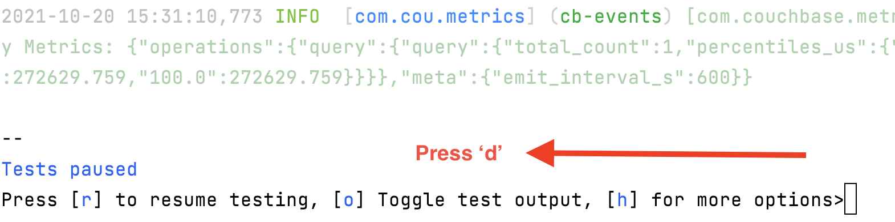
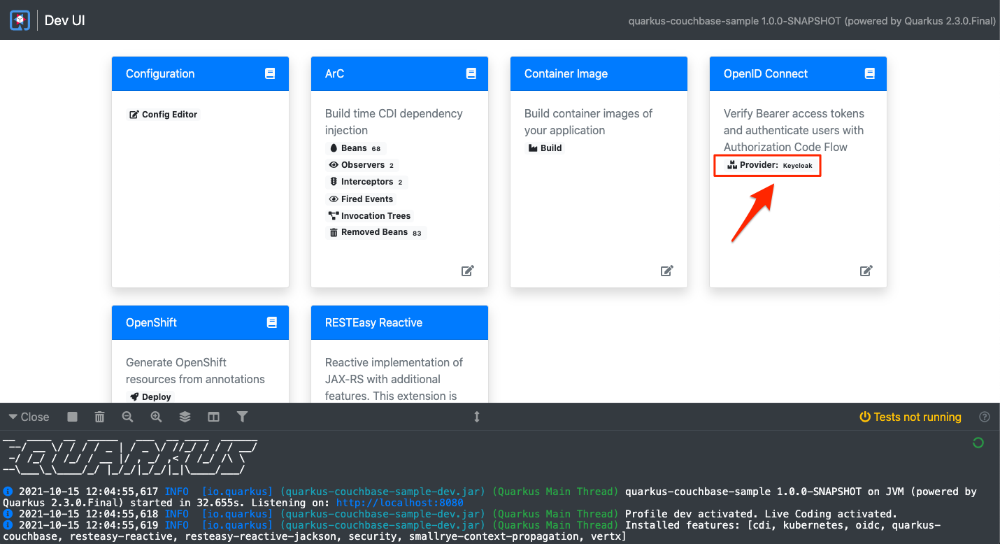
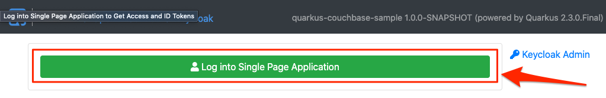
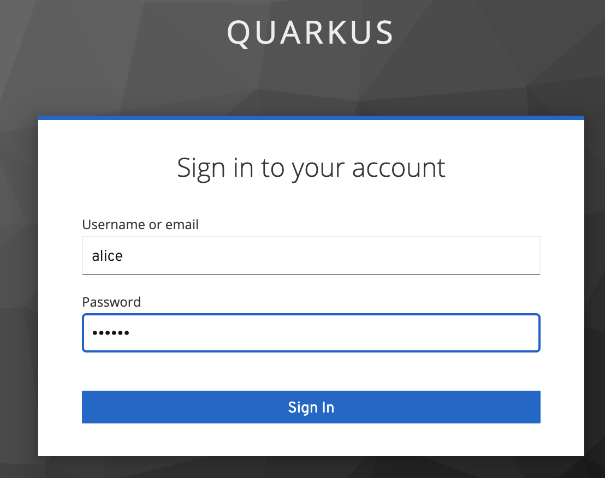
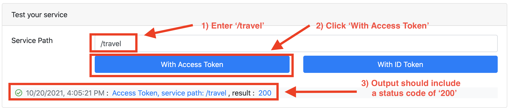

# Quarkus project presented at Couchbase Connect 2021

Demonstrate Quarkus 2.3 together with a 1.0.0-alpha.1 build of
Couchbase.
In particular, the presentation developer agility.
The Quarkus coding focused on developer productivity, demonstrating
how a developer can create a Quarkus project, live code and test
a project by adding Couchbase support,
and query the database.
One feature that time didn't allow for was Quarkus Dev Services.
This README adds the steps that would have been presented had time
allowed.

## Pre-steps
1. Start couchbase; dashboard is accessible using the [Couchbase Container
Docker Hub instructions](https://hub.docker.com/_/couchbase).

        docker run -d --name db -p 8091-8094:8091-8094 -p 11210:11210 couchbase

2. Install the [Travel bucket](https://docs.couchbase.com/server/6.5/manage/manage-settings/install-sample-buckets.html)

3. Optionally, install the [Quarkus CLI](https://quarkus.io/guides/cli-tooling#installing-the-cli).

4. In a separate terminal, start Quarkus in developer mode

       # Starting Quarkus in developer mode using maven
       mvn quarkus:dev

       # Starting Quarkus in developer mode using Quarkus CLI
       quarkus dev

5. Test connectivity

       curl http://localhost:8080/travel


       HTTP/1.1 200 OK
       content-length: 62
       Content-Type: application/json

       ["JW Marriott","The Lodge at Sonoma Renaissance Resort & Spa"]%  

## Adding Quarkus OIDC support

This section demonstrates Dev Services, which is a Quarkus features that offers
zero-config access to backend services.
A Couchbase Dev Service is in progress (as of October, 2021).
Until then, you can secure the HTTP endpoint using ODIC via Keycloak
with no setup and configuration.

1. Add OIDC extension
```shell script
quarkus extension add quarkus-oidc

# The extension will automatically be loaded, with terminal output similar to the following:
# --------
# 2021-10-06 14:19:42,634 INFO  [org.tes.DockerClientFactory] (build-43) Connected to docker: 
# ...
# 14:19:44,511 INFO  [🐳 .io/.0.0]] (build-43) Creating container for image: quay.io/keycloak/keycloak:14.0.0
# 2021-10-06 14:19:44,648 INFO  [🐳 .io/.0.0]] (build-43) Starting container with ID: 04a6f1a33c0f707b7880f6ce502da0cbf70666de8eab8790b66a16c755d539ec
# 2021-10-06 14:19:45,205 INFO  [🐳 .io/.0.0]] (build-43) Container quay.io/keycloak/keycloak:14.0.0 is starting: 04a6f1a33c0f707b7880f6ce502da0cbf70666de8eab8790b66a16c755d539ec
# 2021-10-06 14:19:45,224 INFO  [org.tes.con.wai.str.HttpWaitStrategy] (build-43) /amazing_chatelet: Waiting for 60 seconds for URL: http://localhost:55002/auth (where port 55002 maps to container port 8080)
...
```

2. Uncomment `@RolesAllowed` in TravelResource.java
```java
@RolesAllowed("user")           // <1>
@Path("/travel")
public class TravelResource {
```
<1> Uncomment `@RolesAllowed("user")`

> **_NOTE:_**  Quarkus now ships with a Dev UI, which is available in dev mode only at http://localhost:8080/q/dev/.

3. On the Quarkus CLI, press 'd' to open the Quarkus dev console  in a browser

4. In the Dev Console UI, click *Keycloak* 

5. Access the Single Page Application 

6. Log into Keycloak using username _alice_ and password _alice_ 

7. Enter '/travel' URL, click "With Access Token" button, and valid output includes a value of 200.

